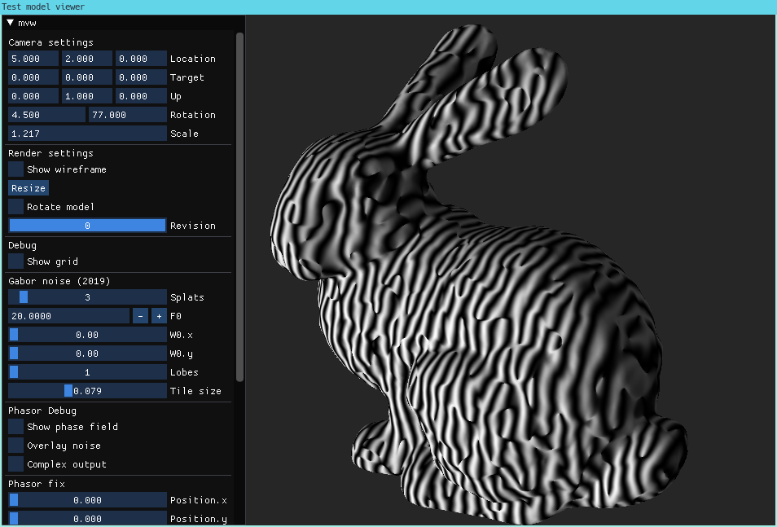

# 3D test model viewer

This repository contains a viewer program showing how to load various 3D model formats and how to
render them using [libshadertoy](https://github.com/vtavernier/libshadertoy) and some techniques
based on sparse convolution (namely, Gabor noise and Phasor noise).

This is only an archive and is not developed actively anymore.

    cd build
    ./viewer -s glsl/phasor-noise-solid.glsl -p glsl/pp-phasor.glsl -g ../bunny.obj

## Building

1. Install system-level dependencies:

        # Debian 10
        sudo apt install -y build-essential cmake libgl1-mesa-dev libepoxy-dev \
            libboost-filesystem-dev libboost-date-time-dev libboost-program-options-dev \
            pkg-config libglm-dev libjpeg-dev libsoil-dev libxrandr-dev libxinerama-dev \
            libxcursor-dev libxi-dev git cpanminus

        # Fedora 34
        sudo dnf install -y g++ cmake libepoxy-devel boost-devel \
            glm-devel SOIL-devel turbojpeg-devel cppzmq-devel zeromq-devel \
            libXrandr-devel libXinerama-devel libXcursor-devel libXi-devel \
            git perl-App-cpanminus

2. The GLSL code is built using the [GLSL Preprocessor](https://github.com/vtavernier/glsl-preprocessor).
   It can be installed with [`cpanm`](https://metacpan.org/pod/App::cpanminus):

        cpanm git://github.com/vtavernier/glsl-preprocessor.git

3. Build the viewer using CMake:

        mkdir -p build ; cd build
        cmake ..
        make -j$(nproc)
        ./viewer -h

## Author

Vincent Tavernier <vince.tavernier@gmail.com>
